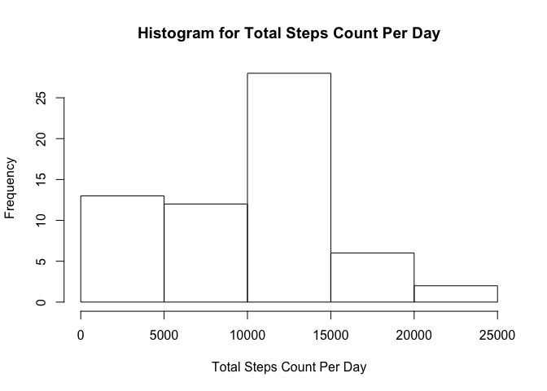
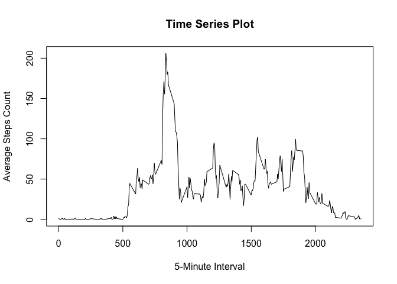
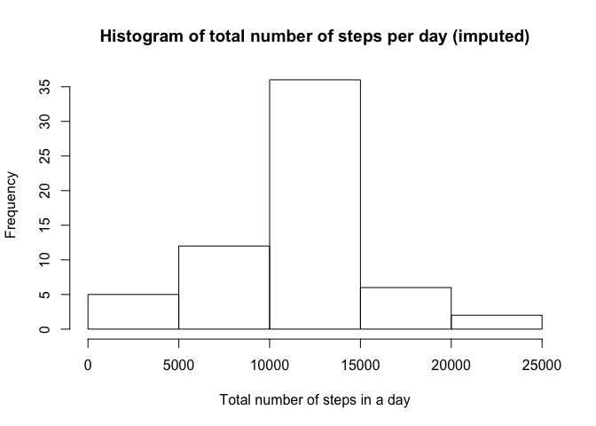
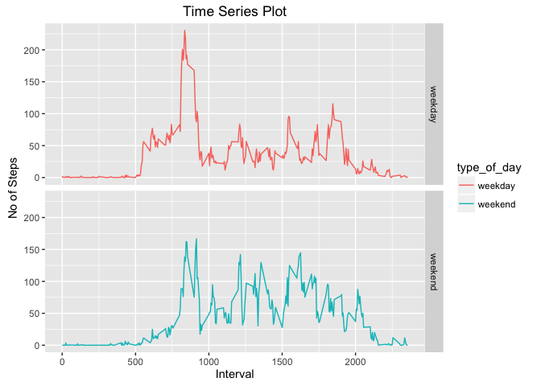

# Reproducible Research: Peer Assessment 1

## Loading and preprocessing the data


```r
library(ggplot2)
library("reshape2")
data <- read.csv("./activity.csv")
```

## What is mean total number of steps taken per day?
1. Calculate the total number of steps taken per day

```r
total_steps_day <- with(data, aggregate(steps, by = list(date),na.rm=TRUE, sum))
names(total_steps_day) <- c("Date", "Count")
head(total_steps_day)
```

```
##         Date Count
## 1 2012-10-01     0
## 2 2012-10-02   126
## 3 2012-10-03 11352
## 4 2012-10-04 12116
## 5 2012-10-05 13294
## 6 2012-10-06 15420
```

2. Make a histogram of the total number of steps taken each day

```r
hist(total_steps_day$Count, main="Histogram for Total Steps Count Per Day", xlab="Total Steps Count Per Day")
```

<!-- -->

3. Calculate and report the mean and median of the total number of steps taken per day

```r
original_mean <- round(mean(total_steps_day$Count,na.rm=TRUE))
cat("Mean of total number of steps taken per day is ",original_mean)
```

```
## Mean of total number of steps taken per day is  9354
```

```r
original_median <- median(total_steps_day$Count,na.rm=TRUE)
cat("Median of total number of steps taken per day is ",original_median)
```

```
## Median of total number of steps taken per day is  10395
```

## What is the average daily activity pattern?
1. Make a time series plot (i.e. 𝚝𝚢𝚙𝚎 = "𝚕") of the 5-minute interval (x-axis) and the average number of steps taken, averaged across all days (y-axis)

```r
average_steps_day <- with(data, aggregate(x=list(avg_steps=data$steps), by = list(interval=data$interval),na.rm=TRUE, FUN=mean))
plot(average_steps_day$interval, average_steps_day$avg_steps, type='l', xlab="5-Minute Interval", ylab="Average Steps Count", main="Time Series Plot")
```

<!-- -->

2.Which 5-minute interval, on average across all the days in the dataset, contains the maximum number of steps?

```r
average_steps_day[which.max(average_steps_day$avg_steps),1]
```

```
## [1] 835
```

## Imputing missing values
Note that there are a number of days/intervals where there are missing values (coded as 𝙽𝙰). The presence of missing days may introduce bias into some calculations or summaries of the data.

1. Calculate and report the total number of missing values in the dataset (i.e. the total number of rows with NAs)

```r
sum(is.na(data$steps))
```

```
## [1] 2304
```

2. Devise a strategy for filling in all of the missing values in the dataset. The strategy does not need to be sophisticated. For example, you could use the mean/median for that day, or the mean for that 5-minute interval, etc.

```r
newData <- data 
for (i in 1:nrow(newData)) {
        if (is.na(newData$steps[i])) {
                newData$steps[i] <- average_steps_day[which(newData$interval[i] == average_steps_day$interval), ]$avg_steps
        }
}
```

3. Create a new dataset that is equal to the original dataset but with the missing data filled in.

```r
head(newData)
```

```
##       steps       date interval
## 1 1.7169811 2012-10-01        0
## 2 0.3396226 2012-10-01        5
## 3 0.1320755 2012-10-01       10
## 4 0.1509434 2012-10-01       15
## 5 0.0754717 2012-10-01       20
## 6 2.0943396 2012-10-01       25
```

```r
cat("Test total number of missing values =",sum(is.na(newData$steps)))
```

```
## Test total number of missing values = 0
```

4. Make a histogram of the total number of steps taken each day and Calculate and report the mean and median total number of steps taken per day. Do these values differ from the estimates from the first part of the assignment? What is the impact of imputing missing data on the estimates of the total daily number of steps?

```r
newTotalSteps <- with(newData, aggregate(x=list(ttl_steps=newData$steps), by = list(date=newData$date), FUN=sum))
head(newTotalSteps)
```

```
##         date ttl_steps
## 1 2012-10-01  10766.19
## 2 2012-10-02    126.00
## 3 2012-10-03  11352.00
## 4 2012-10-04  12116.00
## 5 2012-10-05  13294.00
## 6 2012-10-06  15420.00
```

```r
hist(newTotalSteps$ttl_steps, main="Histogram of total number of steps per day (imputed)", 
     xlab="Total number of steps in a day")
```

<!-- -->

```r
new_mean <- round(mean(newTotalSteps$ttl_steps))
cat("Mean of total number of steps taken per day is ",new_mean)
```

```
## Mean of total number of steps taken per day is  10766
```

```r
new_median <- round(median(newTotalSteps$ttl_steps))
cat("Median of total number of steps taken per day is ",new_median)
```

```
## Median of total number of steps taken per day is  10766
```

These values differ from the estimates from the first part of the assisgnment.
Imputation minimizes bias by preserving all cases (e.g. 01-10-2012) that has missing data.

## Are there differences in activity patterns between weekdays and weekends?
1. Create a new factor variable in the dataset with two levels – “weekday” and “weekend” indicating whether a given date is a weekday or weekend day.

```r
newData['type_of_day'] <- weekdays(as.Date(newData$date))
newData$type_of_day[newData$type_of_day  %in% c('Saturday','Sunday') ] <- "weekend"
newData$type_of_day[newData$type_of_day != "weekend"] <- "weekday"
```


2. Make a panel plot containing a time series plot (i.e. 𝚝𝚢𝚙𝚎 = "𝚕") of the 5-minute interval (x-axis) and the average number of steps taken, averaged across all weekday days or weekend days (y-axis). See the README file in the GitHub repository to see an example of what this plot should look like using simulated data.

```r
newData$type_of_day <- as.factor(newData$type_of_day)
newData_steps_by_interval <- aggregate(steps ~ interval + type_of_day, newData, mean)

ggplot(data=newData_steps_by_interval, aes(x=interval, y=steps)) + geom_line(stat = "identity", aes(colour = type_of_day)) + facet_grid(type_of_day ~ ., scales="fixed", space="fixed") + labs(x="Interval", y=expression("No of Steps"))+ggtitle("Time Series Plot")
```

<!-- -->
